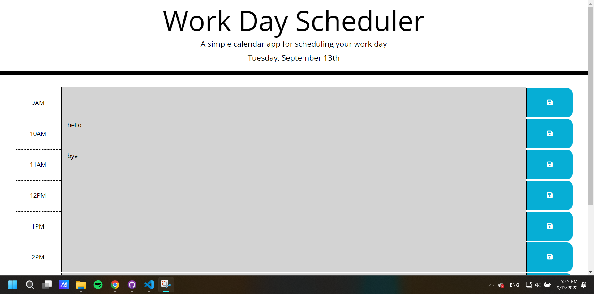

# Module 5 challenge Webpage

## Description

This Module 5 Challenge was created to complete the Module 5 Challenge of the bootcamp.

HTML (index.html) and CSS file (style.css) of the original started code has been updated, and a new JavaScript file (script.js) has been added to implement the functionality of the time blocks in the scheduler. User can now put notes to the description field, save them and view them later even after the webpage has been refreshed. The scheduler will also show the current date and time by changing the color of the time blocks (gray: past, red: present, green: future).

## Installation

N/A

## Usage

Link to the deployed website: https://wongpakho814.github.io/module-5-challenge/

## Credits

N/A

## License

N/A
